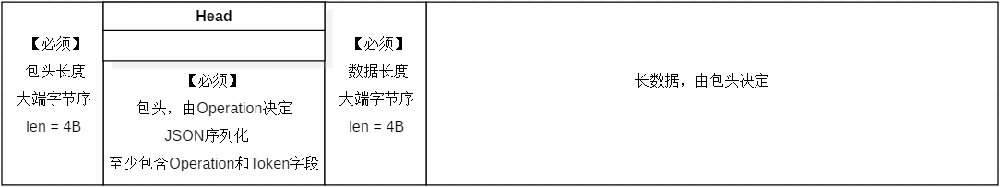
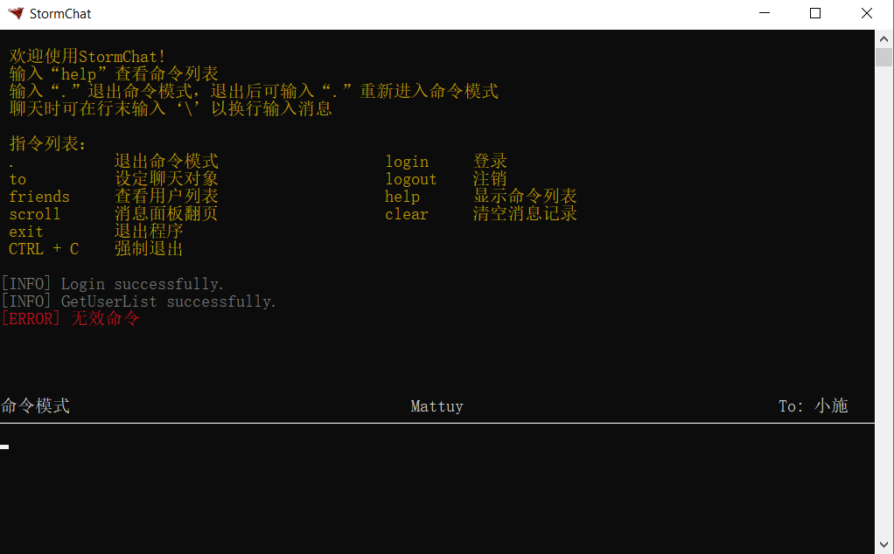
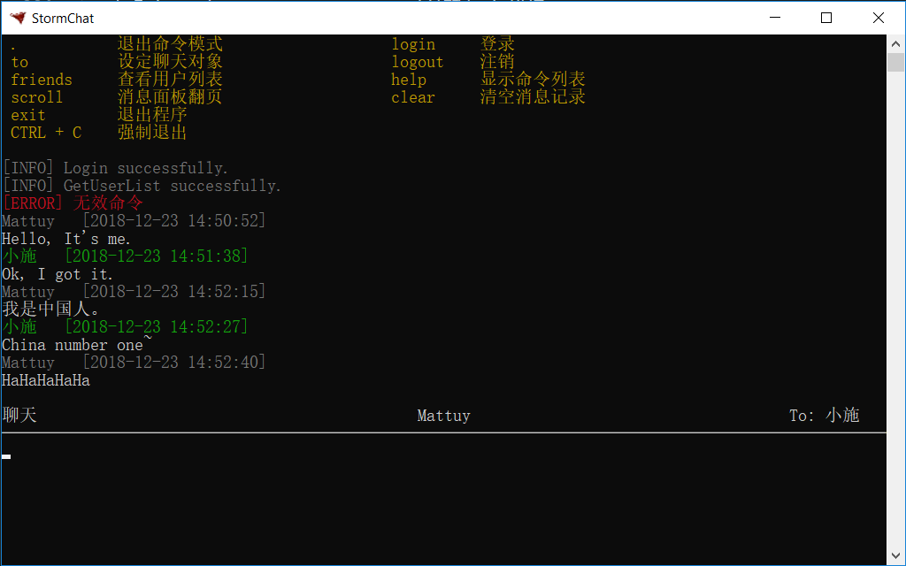

# StormChat

## 目录
* <a href="#intro">简介</a>
* <a href="#design">设计思路</a>
    * <a href="#design-comunication">通信流程</a>
    * <a href="#design-packet-struct">通信数据包结构</a>
* <a href="#env-config">环境配置</a>
    * <a href="#env-config-dev">开发环境</a>
    * <a href="#env-config-run">运行环境</a>
* <a href="#soft-config">程序配置</a>
    * <a href="#soft-config-server">服务器端</a>
    * <a href="#soft-config-client-go">客户端（Go）</a>
    * <a href="#soft-config-client-cs">客户端（C#）</a>
* <a href="#build">如何编译</a>
    * <a href="#build-server">服务器端</a>
    * <a href="#build-client-go">客户端（Go）</a>
    * <a href="#build-client-cs">客户端（C#）</a>
* <a href="#warning">注意事项</a>
* <a href="#dir-struct">目录结构</a>
* <a href="#usage-pic">使用截图</a>

## 简介
&emsp;&emsp;前段时间心血来潮想学习最近的明星编程语言Golang。于是想做个聊天小程序实践一下。程序基于TCP协议通信，更详细的设计见<a href="#design">设计思路</a>。

&emsp;&emsp;用Golang实现了服务端程序，同时代码抄抄改改做了个Golang客户端，又由于输出问题，用C++写了个Windows控制台的简陋的[输出控制库](https://github.com/mattuylee/conctrl)，于是客户端在Windows上能看了（不过朋友说很丑>_<）。

&emsp;&emsp;在朋友（[@Billows](https://github.com/KaniuBillows)）的鼓励下，我们决定用C#写一个客户端程序，正好他在学习WPF编程，于是界面采用了WPF编写。我负责后台数据交互，他负责前台界面逻辑。

&emsp;&emsp;**C#客户端还使用到了JSON格式化库<a href="https://github.com/JamesNK/Newtonsoft.Json">Newtonsoft.Json</a>，特此说明。**

## 设计思路

### 通信流程
1. 发送方（客户端或者服务器）发送数据包；
2. 接收方（服务器或者客户端）处理数据；
3. 如果需要反馈，接收方发送反馈数据包；
4. 发送方处理反馈数据（如果有）。

### 通信数据包结构
数据通信基于TCP协议，每次通信的数据包应包含【包头域+数据域】。包头域总是JSON格式、UTF-8编码的字符串，数据域由包头决定，可以为空。通信数据包结构如图。

HEAD（包头域）至少包含两个参数：
* Toekn
* Operation

Token参数是一次通信的标识文本，由请求方随机生成，处理方返回数据包的Token参数应和请求方的Token参数一致（如果有返回数据）。

Operation参数指定本次通信的请求。它决定了数据包的其他数据。Operation具体行为定义见<a href="design/operations.svg">这里</a>。

本来做了设计图表，不过第一次用starUML，画了一半才发现完全是鬼画桃符，没有掌握正确的作图方式，也没什么热情重新画了。因此这里不展示完整的设计文件了（本来也不完整），上面的链接是截取的关键部分（才知道starUML可以导出html文档）。

至于原文件...留着权当做个纪念，当作自己学习的见证吧（我也很无奈啊(*￣︿￣)）。实在是不嫌弃不怕被误导的话，也可以看看。文件是starUML3的设计文件（.mdj），需要<a href="http://staruml.io/">starUML</a>软件打开（付费的，不过可以免费使用）。这是<a href="design/stormchat.zip">设计文件</a>。

哦，还有服务器端的数据库结构，见文件stormchat-server/res/stormchat.sql。

## 环境配置

1. ### 开发环境
    服务器端：Windows/Linux Golang 1.11  
    客户端-Go：Windows x64，C++，Golang 1.11  
    客户端-C#：Windows，.NET4.0，WPF，Newtonsoft.Json for .NET4.0

2. ### 运行环境
    服务器端：Linux/Windows, MySQL5.5+/MariaDB10.0+  
    客户端：Windows10 x64（其他平台没测试过）

## 程序配置
由于懒癌发作，一些参数设置只能在编译时指定好，没有运行中指定参数的功能。

Go语言的部分（服务器程序和golang客户端程序）这块都在control.go文件中，C#客户端这边也没什么可配置的，也就是连接服务器的地址和端口。下面列出部分配置参数：

### 服务器端
* **serveMode**  
    服务（后台）模式。如果此参数为true，日志输出到str_log_file参数指定的文件中，且Debug()函数将不输出内容。如果为false，日志输出和Debug()函数都将直接向控制台或终端输出。
    
* max_head_length  
    最大包头长度，单位字节，如果包头长度超过此参数将被抛弃。

* max_message_length  
    最大消息长度，单位字节，如果消息长度超过此参数将被抛弃。

* max_photo_size  
    最大头像大小，单位字节，如果头像数据长度超过此参数将被抛弃。

* timeout_message  
    客户端连接最大数据等待时间，单位秒。如果超过此时间客户端没有数据到达则断开连接（此参数当前未启用）。

* str_log_file  
    日志文件。仅在serveMode为true时有效。注意，程序并不会自动清理此文件。

* **str_db_conn_str**  
    MySQL数据库连接字符串。

### 客户端（Go）
* server_addr  
    服务器地址和端口。

### 客户端（C#）
资源定义在StormChat解决方案，Interact项目的属性->资源中。
* RemoteServerAddr  
    服务器地址。

* RemoteServerPort  
    服务器端口。

## 如何编译
首先安装git和golang，这一步请自行解决；

克隆项目到本地：  
> `git clone -b master https://github.com/mattuylee/stormchat.git`

假设项目已克隆到本地*DIR*目录，命令行切换到stormchat目录:

> `cd DIR/stormchat`

1. ### 服务器端
#### 切换到服务器端工程目录：
> `cd stormchat-server`

#### 克隆mysql操作库
Go标准库里是没有数据库操作的库的，因此先添加mysql操作库到项目中。创建目录*sotormchat-server/src/github.com/go-sql-driver/*，然后克隆MySQL操作库：
> `cd src/github.com/go-sql-driver`  
> `git clone https://github.com/go-sql-driver/mysql.git`

#### 配置环境变量GOPATH
Windows下：  
如果环境变量GOPATH存在，则在GOPATH后添加 ";DIR/stormchat/stormchat-server"(不含引号，注意分号)，如果不存在添加GOPATH环境变量并将其设置为*DIR/stormchat/stormchat-server*即可，注意把DIR换成git仓库所在目录。  
Linux下:  
先查看GOPATH环境变量的值，再添加项目目录到GOPATH：
> `echo $GOPATH`  
如果值为空：  
> `export GOPATH=DIR/stormchat/stormchat-server`  
如果值不为空：  
> `export GOPATH=$GOPATH:DIR/stormchat/stormchat-server`

#### 编译程序
切换到stormchat-server/src/stormchat/目录，然后编译：
> `cd DIR/stormchat/stormchat-server/src/stormchat`  
> `go build`
    
#### 配置MySQL
登录mysql：
> `mysql -uroot -p`  

为stormchat创建数据库：
> `CREATE DATABASE stormchat CHARSET=UTF8;`

导入数据库结构:
> `SOURCE DIR/stormchat/stormchat-server/res/stormchat.sql;`

创建用户并授权：
> `CREATE USER 'stormchat'@'localhost' IDENTIFIED BY 'stormchat';`  
> `GRANT ALL ON stormchat.* TO 'stormchat'@'localhost';`  
> `FLUSH PRIVILEGES;`

#### 启动服务器程序
Linux下执行下列命令以守护进程运行：
> `nohup ./stormchat &`

Windows请自行探索。  

2. ### 客户端-Go
> `cd DIR/stormchat/stormchat-client-golang/src`  
> `go build`

注意，**客户端运行时需要conctrl_x64.dll在运行目录**下，此文件在stormchat-client-golang/res/目录下。

3. ### 客户端-C#
Visual Studio 2015以上版本打开项目，直接编译即可。

## 注意事项
* 没有设计注册账户的API，只能在强插数据库。emmmm，这个坑懒得填了。
* 服务器端的日志文件不会自动清除（反正也没什么日志要写）。
* 其他的，想到再补充。

## 目录结构（主要部分）
<pre>
stormchat
│  .gitattributes
│  .gitignore
│  LICENSE          //许可证
│  README.md       //此帮助文件
│  
├─design            //设计文件
│    message.png
│    operations.svg
│    stormchat.zip       //starUML设计文件
│      
│
├─stormchat-server  //服务器端工程目录
│  ├─res
│  │     stormchat.sql  //数据库结构
│  │      
│  └─src                //代码文件
│      └─stormchat
│            control.go
│            err.go
│            main.go
│            message.go
│            session-deprecated.go  //已不推荐使用的接口
│            session.go
│            storm-server.go
│            user.go
│─stormchat-client-golang  //Go客户端工程目录
│  ├─res
│  │     conctrl_x64.dll            //Winodws控制台输出库
│  │     icon.ico                   //客户端图标
│  │      
│  └─src
│        control.go                 //参数控制
│        main.go
│        session.go
│        stormchat-client.syso      //资源文件（图标资源）
│        user.go
│        win-console.go             //输出控制，调用conctrl库
│               
└─stormchat-client-csharp   //C#客户端工程目录
   ├─Interact                   //数据交互模块
   │  │  Interact.csproj            //Visual Studio项目文件
   │  │  Newtonsoft.Json.dll        //JSON格式化库
   │  │  AttrNames.cs               //一些字符串常量
   │  │  Client.cs                  //提供给数据表现模块的静态类
   │  │  Client-Fields.cs           //部分类，定义内部字段
   │  │  Client-Handle.cs           //部分类，处理服务器数据的方法
   │  │  Client-Read.cs             //部分类，接收服务器数据的方法
   │  │  Client-Send.cs             //部分类，向服务器发送数据的方法
   │  │  Exception.cs
   │  │  jsonObject.cs              //定义一些内部使用的结构，用于JSON格式化
   │  │  Message.cs                 //定义一些数据结构，用于数据交换
   │  │  User.cs                    //定义用户
   │  │  
   │  └─Properties                  //项目属性和资源
   │          AssemblyInfo.cs
   │          Resources.Designer.cs
   │          Resources.resx
   │          
   └─StormChatWPF               //数据表现和用户交互模块*
</pre>

## 使用截图
### Golang客户端

